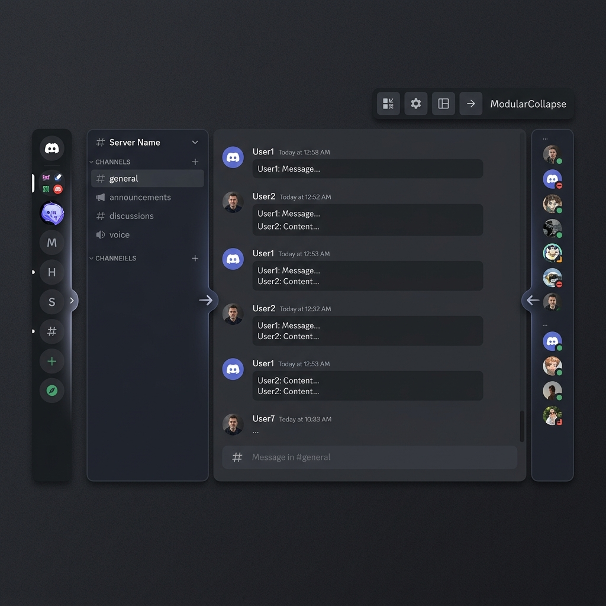

# ModularCollapse
### A Vencord Userplugin

> Ported and modernized from the [BetterDiscord CollapsibleUI](https://github.com/programmer2514/BetterDiscord-CollapsibleUI) plugin by **programmer2514**

A feature-rich plugin that reworks the Discord UI to be significantly more modular.  
Collapse, resize, and float UI panels with keyboard shortcuts, hover expansion, and conditional triggers.

https://github.com/user-attachments/assets/c814fd32-0c4e-45fe-b636-2293d3521e77



---

## ✨ Features

| Feature | Description |
|---------|-------------|
| 🗂️ **Panel Collapse** | Toggle 11 UI panels via toolbar buttons |
| ↔️ **Drag Resize** | Click & drag panel edges to resize. Right-click to reset |
| 🪟 **Floating Panels** | Panels float over chat instead of pushing the layout |
| 🖱️ **Expand on Hover** | Collapsed panels expand when you hover near them |
| ⌨️ **Keyboard Shortcuts** | Configurable key combos for each panel |
| 📐 **Conditional Collapse** | Auto-collapse based on window size (e.g. `innerWidth < 1200`) |
| 📏 **Size Collapse** | Auto-collapse panels when the window is too small |
| 🎨 **Smooth Transitions** | Configurable animation speed |

### Panels supported

- Server List
- Channel List
- Members List
- User Profile
- Message Input
- Window Bar
- Call Window
- User Area
- Search Panel
- Forum Popout
- Activity Panel

---

## 📦 Installation

> **Requires**: Vencord installed **from source** (not the installer).  
> See [Vencord's setup guide](https://docs.vencord.dev/installing/) if needed.

### Method 1 — Git Clone (recommended, easy updates)

```bash
# Navigate to your Vencord userplugins folder
cd /path/to/Vencord/src/userplugins

# Clone this repo as "modularCollapse"
git clone https://github.com/Fantasttic/modularCollapse-vencord.git modularCollapse
```

### Method 2 — Manual Download

1. Download this repository as a ZIP
2. Extract the folder and rename it to `modularCollapse`
3. Place it inside `your-vencord-folder/src/userplugins/`

### After installing

```bash
# Build Vencord
cd /path/to/Vencord
pnpm build

# Inject into Discord (if first time)
pnpm inject
```

4. **Restart Discord**
5. Go to **Settings → Vencord → Plugins** → search **ModularCollapse** → Enable ✅

---

## 🔄 Updating

```bash
cd /path/to/Vencord/src/userplugins/modularCollapse
git pull

cd /path/to/Vencord
pnpm build
```

Restart Discord after building.

---

## 🎮 Usage

Once enabled, **collapse buttons appear in Discord's toolbar** (top-right area).

- **Click** a button to toggle that panel
- **Drag** a panel edge to resize it
- **Right-click** a panel edge to reset its width to default
- Configure everything in **Settings → Vencord → Plugins → ModularCollapse**

### Conditional Collapse Syntax

In the plugin settings, you can enter conditions like:

```
innerWidth < 1200
innerWidth < 1200 && innerHeight > 600
outerWidth >= 1920
```

Supported variables: `innerWidth`, `innerHeight`, `outerWidth`, `outerHeight`  
Supported operators: `<`, `>`, `<=`, `>=`, `==`, `===`, `!=`, `!==`  
Supported logic: `&&`, `||`

---

## 🔒 Security

- ✅ No `eval()` — conditions parsed by a safe built-in evaluator
- ✅ No hardcoded Discord class hashes — uses `findCssClassesLazy`
- ✅ No global scope pollution

---

## 🏗️ Project Structure

```
modularCollapse/
├── index.ts       # Plugin entry, event listeners, lifecycle
├── settings.ts    # DataStore persistence + caching
├── modules.ts     # CSS class mappings
├── elements.ts    # DOM element queries
├── styles.ts      # Dynamic CSS per panel state
├── cssHelper.ts   # Style element utilities
└── constants.ts   # Panel labels & SVG icons
```

---

## 👥 Credits

- **[programmer2514](https://github.com/programmer2514)** — Original [BetterDiscord CollapsibleUI](https://github.com/programmer2514/BetterDiscord-CollapsibleUI) plugin
- **[Fantasttic](https://github.com/Fantasttic)** — Vencord port & modernization

---

## 📄 License

GPL-3.0 — same as Vencord.
