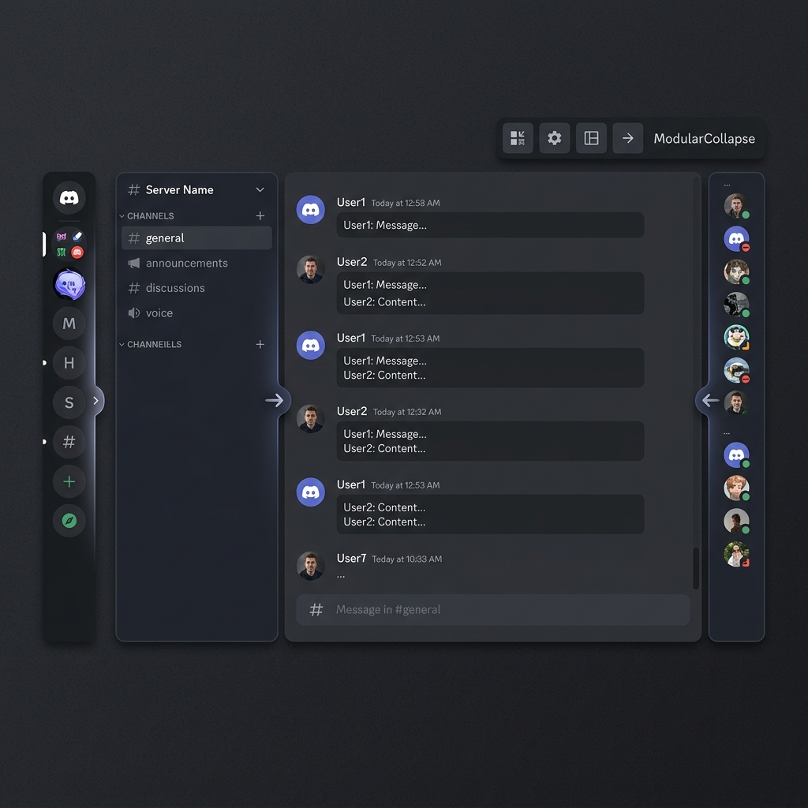

# ModularCollapse
### A Vencord Userplugin

> Ported and modernized from the [BetterDiscord CollapsibleUI](https://github.com/programmer2514/BetterDiscord-CollapsibleUI) plugin by **programmer2514**

A feature-rich plugin that reworks the Discord UI to be significantly more modular.  
Collapse, resize, and float UI panels with keyboard shortcuts, hover expansion, and conditional triggers.


https://github.com/user-attachments/assets/9eebf129-656f-493a-b738-4761f70d4666




---

## ✨ Features

| Feature | Description |
|---------|-------------|
| 🗂️ **Panel Collapse** | Toggle 11 UI panels via toolbar buttons |
| ↔️ **Drag Resize** | Click & drag panel edges to resize. Right-click to reset |
| 🪟 **Floating Panels** | Panels float over chat instead of pushing the layout |
| 🖱️ **Expand on Hover** | Collapsed panels expand when you hover near them |
| ⌨️ **Keyboard Shortcuts** | Configurable key combos for each panel |
| 📐 **Conditional Collapse** | Auto-collapse based on window size (e.g. `innerWidth < 1200`) |
| 📏 **Size Collapse** | Auto-collapse panels when the window is too small |
| 🎨 **Smooth Transitions** | Configurable animation speed |

### Panels supported

- Server List
- Channel List
- Members List
- User Profile
- Message Input
- Window Bar
- Call Window
- User Area
- Search Panel
- Forum Popout
- Activity Panel

---

## 📦 Installation

> **Requires**: [Git](https://git-scm.com/), [Node.js v20+](https://nodejs.org/), and [pnpm](https://pnpm.io/) (`npm install -g pnpm`)

### 🚀 One-Command Install (Recommended)

Choose the script for your operating system. Both do everything automatically:
clone Vencord, add the plugin, install deps, build, and inject into Discord.

#### macOS / Linux

```bash
curl -fsSL https://raw.githubusercontent.com/Fantasttic/modularCollapse-vencord/main/install.sh | bash
```

Or clone the repo first and run locally:

```bash
git clone https://github.com/Fantasttic/modularCollapse-vencord.git
cd modularCollapse-vencord
chmod +x install.sh
./install.sh
```

#### Windows (PowerShell)

```powershell
# Allow script execution (if needed)
Set-ExecutionPolicy -Scope Process -ExecutionPolicy Bypass

# Download and run
Invoke-WebRequest -Uri "https://raw.githubusercontent.com/Fantasttic/modularCollapse-vencord/main/install.ps1" -OutFile "$env:TEMP\install.ps1"
& "$env:TEMP\install.ps1"
```

Or clone the repo first and run locally:

```powershell
git clone https://github.com/Fantasttic/modularCollapse-vencord.git
cd modularCollapse-vencord
.\install.ps1
```

#### Script Options

| Flag | Bash | PowerShell | Description |
|------|------|------------|-------------|
| Method | `-m fork` or `-m userplugin` | `-Method fork` or `-Method userplugin` | Skip the method selection prompt |
| Directory | `-d ~/MyVencord` | `-Dir "C:\MyVencord"` | Custom install directory (default: `~/Vencord`) |
| Skip Inject | `-s` | `-SkipInject` | Skip the Discord injection step |
| Help | `-h` | `-Help` | Show help |

---

### 🔧 Manual Installation

> For users who prefer to install step by step, or already have Vencord from source.

#### Method 1 — Git Clone (recommended, easy updates)

```bash
# Navigate to your Vencord userplugins folder
cd /path/to/Vencord/src/userplugins

# Clone this repo as "modularCollapse"
git clone https://github.com/Fantasttic/modularCollapse-vencord.git modularCollapse
```

#### Method 2 — Manual Download

1. Download this repository as a ZIP
2. Extract the folder and rename it to `modularCollapse`
3. Place it inside `your-vencord-folder/src/userplugins/`

#### After installing

```bash
# Add developer entries (required for compilation)
# In src/utils/constants.ts, add before the closing "} satisfies Record<string, Dev>)":
#   programmer2514: { name: "programmer2514", id: 563652755814875146n },
#   Fantasttic: { name: "Fantasttic", id: 0n },

# Build Vencord
cd /path/to/Vencord
pnpm build

# Inject into Discord (if first time)
pnpm inject
```

4. **Restart Discord**
5. Go to **Settings → Vencord → Plugins** → search **ModularCollapse** → Enable ✅

### 🛠️ Local Development (Apply Local Changes)

If you are working on this plugin locally and want to quickly apply and test changes in your Discord client, run:

```bash
npm run apply
```

This single command:
1. Creates a symlink from this local workspace folder directly to your `~/Vencord` userplugins directory.
2. Configures necessary developer credentials inside Vencord.
3. Automatically installs dependencies and builds the Vencord client.
4. Reinjects Vencord into Discord.

---

## 🍎 macOS DMG Installer

A pre-built DMG is available for macOS. Simply download, open, and double-click the installer app.

```bash
# Or build the DMG yourself:
./build_dmg.sh
```

---

## 🔄 Updating

```bash
cd /path/to/Vencord/src/userplugins/modularCollapse
git pull

cd /path/to/Vencord
pnpm build
```

Restart Discord after building.

---

## 🎮 Usage

Once enabled, **collapse buttons appear in Discord's toolbar** (top-right area).

- **Click** a button to toggle that panel
- **Drag** a panel edge to resize it
- **Right-click** a panel edge to reset its width to default
- Configure everything in **Settings → Vencord → Plugins → ModularCollapse**

### Conditional Collapse Syntax

In the plugin settings, you can enter conditions like:

```
innerWidth < 1200
innerWidth < 1200 && innerHeight > 600
outerWidth >= 1920
```

Supported variables: `innerWidth`, `innerHeight`, `outerWidth`, `outerHeight`  
Supported operators: `<`, `>`, `<=`, `>=`, `==`, `===`, `!=`, `!==`  
Supported logic: `&&`, `||`

---

## 🔒 Security

- ✅ No `eval()` — conditions parsed by a safe built-in evaluator
- ✅ No hardcoded Discord class hashes — uses `findCssClassesLazy`
- ✅ No global scope pollution

---

## 🏗️ Project Structure

```
modularCollapse/
├── index.ts                  # Plugin entry, event listeners, lifecycle
├── settings.ts               # DataStore persistence + caching
├── modules.ts                # CSS class mappings
├── elements.ts               # DOM element queries
├── styles.ts                 # Dynamic CSS per panel state
├── cssHelper.ts              # Style element utilities
├── constants.ts              # Panel labels & SVG icons
├── CollapseSettingsPanel.tsx  # Settings UI component
├── CollapseSettingsPanel.css  # Settings UI styles
├── install.sh                # macOS/Linux installer script
├── install.ps1               # Windows installer script (PowerShell)
└── build_dmg.sh              # macOS DMG builder
```

---

## 👥 Credits

- **[programmer2514](https://github.com/programmer2514)** — Original [BetterDiscord CollapsibleUI](https://github.com/programmer2514/BetterDiscord-CollapsibleUI) plugin
- **[Fantasttic](https://github.com/Fantasttic)** — Vencord port & modernization

---

## 📄 License

GPL-3.0 — same as Vencord.
